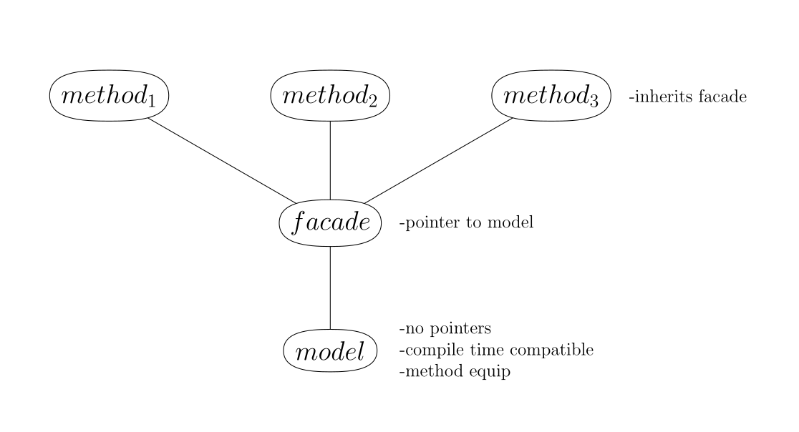
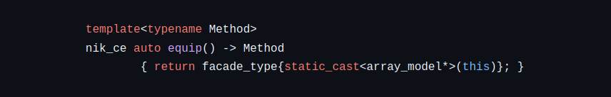
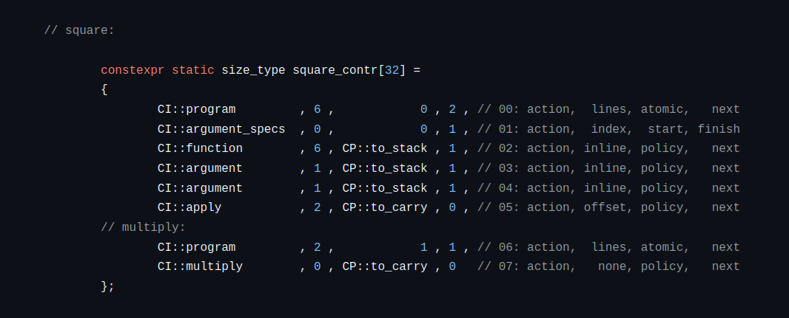

# C++ Continuation Constructing Template Meta Programming Library
-------------------

A self-contained library of tools to prototype and build lexers, parsers, as well as compilers.

## Philosophy

Modern C++ needs to be **safe** C++. The code in this library is intended to meet the following requirements:

1. Language tools such as lexers, parsers, and compilers need to be safe, expressive, potent.
2. Such tools demand the highest level of scrutiny when it comes logical consistency.
3. Achieving both consistency and performance in tooling is *preferred*.
4. When a tradeoff is required, consistency of tooling is *privileged* over performance.

## Motivation

## Fundraising

## Methodology

Here I summarize the paradigms I employ to achieve the above stated philosophical designs. Following this
we will go through each idea in more detail.

In the most general sense, my approach to the problem of C++ safety is aligned with the *subset of a superset*
strategy, where the C++ language is first extended and that extension is then subsetted to be safe. My approach
differs in how it actually goes about trying to achieve this goal.

In particular, I claim C++17 and above are already powerful enough that safe extensions can be simulated
at compile time, to be used in the compilation process without additional cost to run time performance.
This is achieved through several techniques making use of C++'s multiparadigm design.

Before continuing, I should clarify this library does not use other libraries
such as Boost or even the C++ standard (std::).

### Method Equip

The first paradigm of this library is a specialized version of C++ object oriented programming designed
to be compatible with compile time (constant expression) use:

Models are classes intended to hold simple data structures (such as C style arrays) and as few methods as possible.
They have no pointer members which means they can be assigned as constexpr values. Models also have a special
collection of *equip* member functions:

This technique can be considered a variation of *dependency injection*, but the overall idea is to modularize
the member functions out of data structure classes: Instead of hardcoding the member functions into a single model
class, we equip the models with method classes as needed.

For example we may wish to push a value to an array in one context, but in another we might want to prevent
pushing duplicate values. This can be done as two separate array classes, or even two separate member functions
within the same class, but the method equip paradigm allows us to achieve the same effect while keeping code
organization cleaner, and with the ability to reuse names (such as "push").

This also means we can call method classes inside the definitions of other method classes that share the same model,
which is a very powerful technique used critically in this library.

Finally, this paradigm is compile time compatible because it shifts the use of temporary pointers to method classes
whose lifetimes themselves are meant to be temporary.

This paradigm underlies and acts as foundation for all other code in this library.

### Type Theory

The major paradigm of this library is to introduce an algebra of proof assistants which are
based on formal type theory. I reference the following two textbooks as theoretical sources:

[Type Theory and Functional Programming](https://www.cs.kent.ac.uk/people/staff/sjt/TTFP/ttfp.pdf)
[Homotopy Type Theory](https://homotopytypetheory.org/book/)

Think of these proof assistants as secondary or *second-tier* type systems to be used in conjunction
with C++'s builtin one. Such type systems are intended at minimum to support the following types:

- empty
- ring (~unsigned integers)
- flex (~floating point numbers)
- utf8\_char
- tuple
- cotuple (~std::variant)
- function
- list (~singly linked list)
- identity
- forall
- exists

The idea is, once you introduce the *identity* type as well as dependent types such as *forall* and *exists*,
you can then represent mathematical **specifications** as objects within the type system itself.

The bigger picture is that specifications can be defined within the type system, and then **proofs**
(which are also represented in the type system) can be given as well as verified to show that objects
of interest meet our required restrictions.

#### Compile Time Use

Modern C++ offers the *constexpr* keyword. Because of this, we can refine our conceptualization of *compile time*:

1. **metacompile time** - C++ objects/values are immutable and can generally be passed as template parameters.
2. **metarun time** - C++ objects/values are mutable within restricted scopes. They are not able to be passed as
template parameters, but become metacompile time versions of themselves when their lifetimes extend beyond those
restricted scopes.

The proof assistants in this library are designed to be compatible as compile time objects: They can be built
during metarun time scopes, and then used at compile time to help build C++ runtime code. There are several
benefits in adhering to this style of design.

##### Undefined Behaviour

Running constexpr code at compile time has tradeoffs.

One of the greatest advantages is safety: When the compiler runs your code at compile time it is acting
as an interpreter. Compilers more than any other software require strict guarantees such as the guarantee they
will **halt**. For example: Is your program compiling? Or is the compiler stuck in an infinite loop?

Due to these strict requirements, C++ compilers do not allow *undefined behaviour* while running compile time code.
This prevents entire classes of bugs within these type systems when they're used at compile time.

With that said, one of the greatest disadvantages is compiler resource requirements:

-GCC -fconstexpr-depth=2048
-Clang -fconstexpr-steps=2097152 (2^21)

Related to this is performance: Interpreters tend to be orders of magnitude slower than running code which is first
compiled. If done well, the slowdown is in the seconds range. If done poorly, it's in the minutes range or longer.

##### Metacompilation

What about functions within these compile time type systems?

Function values are represented internally using an in-house bytecode that resembles assembly language:

This library supports running this style of bytecode at compile time in two distinct ways:

1. Virtual Machines (VM) - Method classes are provided that allow one to run bytecode using a virtual machine.
2. Continuation Constructing Machines (CCM) - An emergent effect using templated and variadic continuation passing
   functions that in effect injects bytecode into the C++ compiler's syntax tree.

What are the differences between the virtual and continuation constructing machine approaches?

The easiest explanation is summarized in this (informal) square function data table:

|Compiler |VM Binary Size|CCM Binary Size|
|---------|--------------|---------------|
|GCC   -O1|           36K|            16K|
|Clang -O1|           72K|            16K|

The virtual machine is software that simulates hardware, and runs this library's bytecode on top of it.
As for continuation constructing machines, C++ compilers end up recognizing this library's bytecode as
C++ functions which run directly on hardware. This is to say: The VM approach creates larger binary
file sizes, and is slower than the CCM approach in terms of performance.

### Proof Orientation

The type systems allow one to declare and define two varations of type values:

1. Abstract -
2. Concrete -

### Self Hosting

#### Domain Specific Languages

#### Serialization

### Interoperability

How do these second-tier type systems interoperate with C++'s type system?

In C++17 through C++23 it has some limits. Notably 

In C++26 it does not.

#### C++26

## Roadmap

The timeline given here is done so under the assumption that this project is being worked on full-time.

A general purpose library oriented around and built on top of a *metapiler*
paradigm: It offers the ability to translate embedded sublanguages (represented as
constexpr string literals) into constexpr functions. This paradigm allows for
the creation of domain specific languages to ease the creation of domain specific
modules and sublibraries.

This metapiler paradigm is achieved using a combination of constexpr and TMP magic.
Emphasis is on constexpr for reliability and performance, but even when TMP is used,
its design adheres as closely as possible to Type Theory with the intent of keeping
it reasonably type safe. The frontend (lexer/parser) components are constexpr oriented,
referencing The Dragon Book on compiler theory for their implementation. The backend
achieves its translation by making use of a theoretical correspondence between assembly
language and an extension of continuation passing style.

This project is currently proof of concept, with the following roadmap leading to
a version 1.0 release:

a) The major goal for a version 1.0 release is to build two embedded domain specific languages (DSL) which will then be used
to rebuild as much of this library as is reasonable. The idea is for it to be semi-self hosting.

b) The first DSL is call Chord: It is a generic assembly which supports a chord progression paradigm. This chord progression
paradigm offers grammar to create functional operators { repeat, map, fold, find, sift }.

c) The second DSL is a Scheme-like language called Hustle: It is intended to be as close to Scheme as is reasonable given
the differences in their underlying computational models.

d) Both languages will be implemented using a common DSL Engine which supports a common continuation assembly language.

e) Continuation Assembly: This is a metaobject assembly (used to build constexpr functions through continuation machines).
I will be adding markup instructions so that DSL architects can encode documentation into their front end translations.
I will (re)implement my Chord and Hustle langs to do the same, and will provide an initial -O0 backend.

f) Higher Order Functions: The Hustle lang should be able to pass expressions as arguments to function calls.
This becomes a problem relative to the underlying continuation machine type system. This problem will be solved
by adding in new continuation machines to support expression trampolining. Notably, it is the conditional expression
(if pred ante conse) that complicates things.

As such, I will add in machines that compute the predicate function, which then returns a deferral:

A deferral is a pair that holds the branching subroutines as compile time objects, and holds the predicate return
as a constexpr runtime bool value. The thing to note is that the function created to evaluate the expression is guaranteed
to return a single type. Once returned, we check to see if it is a trampolined value: If so we try again and reevaluate,
otherwise we pass the resolved value to the next instruction accordingly.
This works because we're within a larger continuation's scope.

The Hustle lang will need to be tweaked to update this approach.

g) Syntax Tree Exposure:

For the initial purpose of encoding data structures within the continuation assembly, and in particular the intent
of creating a DSL to freely manipulate tuples (while deferring tuple type commitment), a syntax tree IR is required.

The hustle lang is a natural choice to support this, and as such I've decided I will add in grammar to work
with both C++ (imported) types, as well as this syntax tree IR. What this means in the long run is that
the Hustle lang will also need to support the ability to convert between these representations.

h) Add in lexer, structure, and LR(1) generators;
i) add in error messaging.
j) add in unit tests.

At such a point the project's version 1.0 will be done. I intend to leave backend optimizers to others.
As this project grows and stabilizes, I hope you find it to be of interest, and even maybe some use.

Thank you.

