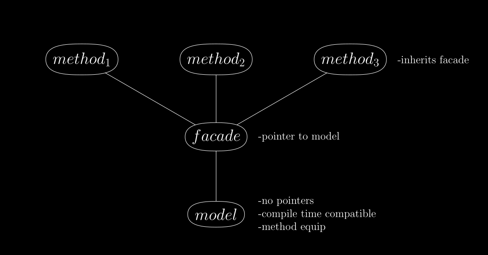

# C++ Continuation Constructing Template Meta Programming Library
-------------------

A self-contained library of tools for prototyping and building lexers, parsers, as well as compilers.

## Philosophy

Modern C++ needs to be **safe** C++. The code in this library is intended to meet the following designs:

1. Language tools such as lexers, parsers, and compilers need to be safe, expressive, potent.
2. Such tools demand the highest level of scrutiny when it comes logical consistency.
3. Achieving both consistency and performance in tooling is *preferred*.
4. When a tradeoff is required, consistency of tooling is *privileged* over performance.

## Methodology

Here I summarize the paradigms I employ to achieve the above stated philosophical designs. Following this
we will go through each idea in more detail.

In the most general sense, my approach to the problem of C++ safety is aligned with the *subset of a superset*
strategy, where the C++ language is first extended and that extension is then subsetted to be safe. My approach
differs in how it actually goes about trying to achieve this goal.

In particular, I claim C++17 and above are already powerful enough that safe extensions can be simulated
at compile time, to be used in the compilation process without additional cost to run time performance.
This is achieved through several techniques making use of C++'s multiparadigm features.

Before continuing, I should clarify this library does **not** use other libraries
such as Boost or even the C++ standard (std::).

### Method Equip

The first paradigm of this library is a specialized version of C++ object oriented programming designed
to be compatible with compile time (constant expression) use:

Models are classes intended to hold simple data structures (such as C style arrays) and as few member functions
as possible. They have no pointer members which means they can be assigned as constexpr values. As these models
are intended for compile time use, the their memory sizes are expected to be known in advance. Models also have
a special collection of *equip* member functions:

This paradigm can be considered a variation of *dependency injection*, but the overall idea is to modularize
member functions out of data structure classes: Instead of hardcoding the member functions into a single model
class, we equip the models with method classes as needed.

For example we may wish to *push* a value to an array in one context, but in another we might want to push
without duplicate values. This can be done as two separate array classes, or even two separate member functions
within the same class, but the method equip paradigm allows us to achieve the same effect while keeping code
organization cleaner, and with the ability to reuse names (such as "push").

This also means we can call method classes inside the definitions of other method classes that share the same model,
which is a very powerful technique used critically throughout this library.

Finally, this paradigm is compile time compatible because it shifts the use of temporary pointers to method classes
whose lifetimes themselves are meant to be temporary.

This paradigm underlies and acts as foundation for all other code in this library.

### Type Theory

The major paradigm of this library is to introduce an algebra of proof assistants which are
based on formal type theory. I reference the following two textbooks as theoretical sources:

[Type Theory and Functional Programming](https://www.cs.kent.ac.uk/people/staff/sjt/TTFP/ttfp.pdf)

[Homotopy Type Theory](https://homotopytypetheory.org/book/)

Think of these proof assistants as secondary or *second-tier* type systems to be used in conjunction
with C++'s builtin one. Such type systems are intended at minimum to support the following types:

- empty
- ring (~unsigned integers)
- flex (~floating point numbers)
- utf8\_char
- tuple
- cotuple (~std::variant)
- function
- list (~singly linked list)
- identity
- forall
- exists

The idea is, once you introduce the *identity* type as well as dependent types such as *forall* and *exists*,
you can then represent mathematical **specifications** as objects within the type system itself.

The bigger picture is that specifications can be defined within the type system, and then **proofs**
(which are also represented in the type system) can be given and verified to show that objects
of interest meet our requirements.

#### Compile Time Use

Modern C++ offers the *constexpr* keyword. Because of this,
we can refine our understanding of what *compile time* means:

1. **metacompile time** - C++ objects/values are immutable and can generally be passed as template parameters.
2. **metarun time** - C++ objects/values are mutable within restricted scopes. They are not able to be passed as
template parameters, but become metacompile time versions of themselves when their lifetimes extend beyond those
restricted scopes.

The proof assistants in this library are designed to be compatible as compile time objects: They can be built
during metarun time scopes, and then used at compile time to help build C++ runtime code. There are several
benefits in adhering to this style of design.

##### Undefined Behaviour

Running constexpr code at compile time has tradeoffs.

One of the greatest advantages is safety: When the compiler runs your code at compile time it is acting as
an interpreter. Compilers more than any other software require strict guarantees such as the assurance that
they will **halt**. For example: Is your program compiling? Or is the compiler stuck in an infinite loop?

Due to these strict requirements, C++ compilers do not allow *undefined behaviour* while running compile time code.
This prevents entire classes of bugs within these type systems when they're used at compile time.

With that said, one of the greatest disadvantages is compiler resource requirements:

-GCC -fconstexpr-depth=2048

-Clang -fconstexpr-steps=2097152 (2^21)

Related to this is performance: Interpreters tend to be orders of magnitude slower than running compiled code.
If done well, the slowdown is in the seconds range. If done poorly, it's in the minutes range or longer.

##### Metacompilation

What about functions within these compile time type systems?

Function values are represented internally using an in-house bytecode that resembles assembly language:

This library supports running this style of bytecode at compile time in two distinct ways:

1. Virtual Machines (VM) - Method classes are provided that allow one to run bytecode using a virtual machine.
2. Continuation Constructing Machines (CCM) - An emergent effect using templated and variadic continuation passing
   functions that in effect injects bytecode into the C++ compiler's syntax tree.

What are the differences between the virtual and continuation constructing machine approaches?

The easiest explanation is summarized in this (informal) square function data table:

|Compiler |VM Binary Size|CCM Binary Size|
|---------|--------------|---------------|
|GCC   -O1|           36K|            16K|
|Clang -O1|           72K|            16K|

The virtual machine is software that simulates hardware, and runs this library's bytecode on top of it.
As for continuation constructing machines, C++ compilers end up recognizing this library's bytecode as
C++ functions which run directly on hardware. This is to say: The VM approach creates larger binary
file sizes, and is slower than the CCM approach in terms of performance.

I will add that although CCM is an emergent effect, it is of sound design. I have given two talks about it here:

[C++ is a metacompiler - C++Now 2024](https://www.youtube.com/watch?v=IgNSBXypwrY)

[C++ is a metacompiler - CppNorth 2024](https://www.youtube.com/watch?v=zngToaBjHVk)

### Proof Orientation

The type systems of this library offer two ways to declare values:

1. Abstract - Values which are internal to the type system itself.
2. Concrete - Symbolic addresses representing values stored external to the type system.

If a given type system lives at compile time, then so do its abstract values. It is the policy of these
type systems that abstract values are immutable and unique. These restrictions allow us to compress the
representation of values using indirection. They also free us from the equivalent of pointer lifetime bugs
that would otherwise occur through internal indirections.

If a given type system lives at compile time, then so do its concrete addresses. As such addresses are symbolic,
they can be used to reference memory being used during *metarun time* or even **_runtime_** itself.

This leads us to the critical paradigm of this library: Extending C++
object oriented programming to become C++ *proof oriented programming*.

One of the major features of object oriented programming is the ability to define member values and member functions.
We can now simulate this by assigning a compile time type system to a C++ class defined with a simple memory container
such as std::array or std::vector.

The assumption is the type system will contain the desired functions (and even constant values),
as well as the structural information needed to complete the C++ class definition:

As our type system consists of *algebraic data types*, it is sufficiently expressive to represent any possible
data structure---these type systems are in fact *universal* data structures.

By simulating object oriented programming in this way, we are also extending their abilities. During the construction
of a given type system (at metarun time), we can create specifications and proofs demonstrating the class we're about
to define has certain properties of interest. This is similar to *C++ concepts* except it is much more powerful as
we can prove any *mathematical truth* about these types, values, and functions.

We also create an improved interface for compile time error messages. A string type can be defined as a list
of characters, where a character is a cotuple of the four of utf\_char types distinguished by byte size:

Utf8String := List Utf8Char

Utf8Char   := (Utf8Char1 | Utf8Char2 | Utf8Char3 | Utf8Char4)

From there, when our code recognizes an error, it can log it as a string and short-circuit. Once our type system
is constructed we check if it has any errors, if so we can use the logged message to dispatch accordingly.

### Self Hosting

For as important is the proof oriented paradigm is, it is matched with a self hosting paradigm.

Self hosting is the pattern of using a programming language to write its own compiler. This paradigm is well
suited for prototyping variations on compiler designs. In the context of compile time programming, it also mitigates
the use of compiler resources, as well as compilation units, and thus compile times themselves.

It should be noted that I choose to use the term *semiself hosting* to distinguish the fact that this library
is not intended to build a full C++ compiler: It is intended to build lexer and parser generators, as well as
specific lexers and parsers themselves.

The main technique for achieving semiself hosting within this
library is the use of embedded domain specific languages (DSLs).

#### Domain Specific Languages

The idea is we build a version 0.0.0 parser generator, and we use compile time C++ to do it.
We do the same for a lexer generator. With these we then build a small number of domain specific languages.

The goal is to use these initial DSLs to make it easier to generate type system byte code for functions.
Once this is achieved, we use these DSLs to generate byte code for version 1.0.0 lexer and parser generators.
Once we have such generators defined as types and values internal to our type system, we can specify and
prove their consistency and reliability.

We then use these generators and DSLs to build richer DSLs that allow us to rebuild our base tools yet again.
This is the meaning of semiself hosting within this library.

It all sounds nice, but is this achievable?

I have already built a proof of concept parser generator along with two DSLs respectively named
**chord** and **hustle**. The *chord* language offers grammar to readily create functional operators
{ repeat, map, fold, find, sift }, and otherwise gives a grammatical appearance similar to assembly languages.
As for *hustle*, it is intended to be a *scheme*-like (lisp) language.

#### Serialization

As our type systems grow in complexity, either by growing our inventory of functions or proofs, how do we
mitigate slow metacompile times? The short answer: *Serialization*.

One of the reasons I chose the *method equip* paradigm for designing the compile time data structures of this
library is because it aligns well with serialization. The type systems of this library are in actuality each
a handful of numerical arrays. It means they are easy to print out to file. It also means they are easy to read
back in to rebuild a given type system.

This means we can build, analyze, verify functions, specifications, and proofs at metarun time, then write that
data to file to later be read back in as a compile time object. In effect we are saving our work. This is similar
to the way C++ compilers build object code which can be linked during final compilation.

There are several benefits to doing serialization in this way.

For starters, rather than type checking a bytecode function every single time we run (and rerun) the compiler,
we can write a type checking specification and prove the given function to be valid. If we keep the proof we
don't need to reverify each time unless prompted to do so.

Another advantage is being able to allocate accurate model sizes. When building type systems at compile time
the first time around, we would allocate extra memory not knowing how much we need in advance. When the type
system of interest has stabilized, it can be written to file using only as much memory is required. When
reading the type system arrays back in, we now know in advance the exact memory size we need and so can
optimize memory use with that in mind.

### Interoperability

How do these second-tier type systems interoperate with C++'s type system?

In C++17 through C++23 it has some limits. Notably floating point numbers. The the type systems are currently
designed in C++17, and only support internal arrays of a given integer type. As consequence, representing
floating point numbers as *abstract values* must be simulated which comes with tradeoffs.

The other consideration is whether or not we can represent C++'s non-builtin types within these type systems.
Any solution to this consideration requires byte alignment tools, which either aren't supported or aren't
easily supported at compile time.

The first consequence here is that abstract values require ad-hoc designs to achieve interoperability.
As for concrete values, if such values are in fact proper runtime values, placement new solves interoperability
issues as our array memory is preallocated.

In anycase, it should be noted that C++26 does not have any of these problems.

#### C++26

C++26 is well suited for implementing this library. It has a number of features which are of immediate use:

-variadic indexing
-static\_assert
-placement new
-#embed

Variadic indexing can be used to simplify continuation constructing machines. Static assert means the error
messages of our compile time type systems can be directly printed out as part of the compiler's own error message.
Placement new can be used at compile time, meaning floating point numbers can be represented, and byte alignment
can be used to map C++'s non-builtin types directly into and out of these second-tier type systems.

## Motivation

## Fundraising

## Roadmap

The timeline given here is done so under the assumption that this project is being worked on full-time.

h) Add in lexer, structure, and LR(1) generators;
i) add in error messaging.
j) add in unit tests.

Thank you.

